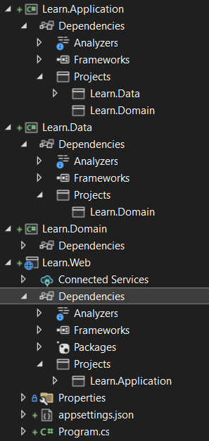

# Creating .NET Project

This documentation page will guide you through the steps to create a new ASP.NET Core Web API project on Visual Studio and configure it to use Codeed Framework.

## Creating project on Visual Studio

- [ ] Launch the Visual Studio IDE on your computer.
- [ ] Click on "Create a new project" on the start page or go to File -> New -> Project.
- [ ] Select the "ASP.NET Core Web API" template under the "Create a new project" window. Choose "Next."
- [ ] Name the project `Learn.Web` and choose a location on your computer where you want to save the project files. Choose "Create."
- [ ] In the "Additional Information" window, select ".NET 6" under the "Target Framework" dropdown. Choose "Create."

You can delete the WeatherForecast class as well as its controller

## Adding Projects to the Solution

In addition to the Learn.Web project, we will also create the following projects to organize the solution and separate concerns:

### Learn.Domain

This project will contain the domain models, interfaces, and any domain logic. This layer represents the core of the application.

To create the Learn.Domain project:

- [ ] Right-click on the solution in Solution Explorer and select "Add" -> "New Project."
- [ ] Select the "Class Library" template under the ".NET" category. Choose "Next."
- [ ] Name the project Learn.Domain and choose a location on your computer where you want to save the project files. Choose "Create."
- [ ] In the "Additional Information" window, select ".NET 6" under the "Target Framework" dropdown. Choose "Create."
- [ ] Remove Class1.cs

### Learn.Application

This project will contain the application logic, which includes the services, commands, queries, and any other business logic specific to the application.

- [ ] To create the `Learn.Application` project, repeat the same steps as in `Learn.Domain`, but with the name changed to `Learn.Application`.

### Learn.Data

This project will contain the data access logic, including the database context, repositories, and data models.

- [ ] To create the `Learn.Data` project, repeat the same steps as in `Learn.Domain`, but with the name changed to `Learn.Data`.

## Install Codeed.Framework packages

 - [ ] Install the NuGet packages according to the project:

=== "Learn.Web"

    ``` powershell
    Install-Package Codeed.Framework.AspNet
    ```

=== "Learn.Domain"

    ``` powershell
    Install-Package Codeed.Framework.Domain
    Install-Package Codeed.Framework.Data
    ```

=== "Learn.Data"

    ``` powershell
    Install-Package Codeed.Framework.Data
    ```    

=== "Learn.Application"

    ``` powershell
    Install-Package Codeed.Framework.AspNet
    Install-Package Codeed.Framework.Models
    Install-Package Codeed.Framework.Services
    Install-Package Codeed.Framework.Services.Http
    ```        

## Referencing Projects

- [ ] Reference the projects to establish the following relationships:

=== "Learn.Web"

    Add `Learn.Application` to the projects references

=== "Learn.Data"

    Add `Learn.Domain` to the projects references

=== "Learn.Application"

    Add `Learn.Domain` to the projects references

    Add `Learn.Data` to the projects references

By following the instructions, you should arrive at a solution that looks like the one in the image below:

{ loading=lazy }
